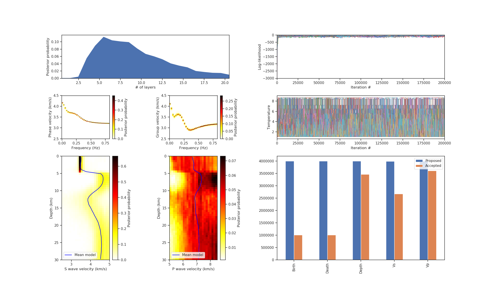

# SEIS_FILO
SEISmological tools for Flat Isotropic Layered structure in the Ocean; forward computation & transdimensional inversion

Copyright (C) 2019 Takeshi Akuhara


---

## Programs included in this package
* [__rayleigh_fwd__](#Rayleigh-wave-forward-computation): Rayleigh wave forward computation
* [__rayleigh_inv__](#Rayleigh-wave-inversion): Rayleigh wave transdimensional inversion by RJMCMC
* [__Plot_utilities__](#Plot-utilities)

## Install
Type `make` in the `src` directory.

---

## Rayleigh wave forward computation
### USAGE
`rayleigh_fwd [parameter file]`
### Parameter file
* Need to specify the following parameters in this file.
  * __fmin__, __fmax__, __df__ (Minimum, maximum, and interval of frequency at which dispersion curve is calculated)
  * __cmin__, __cmax__, __dc__ (Minimum, maximum, and interval of phase velocity used for root search)
  * __vmod_in__ (file name for input velocity model)
  * __ray_out__ (file name for output dispersion curve)
* Comment out by "#" works fine.
```
# Parameter file example
fmin = 0.01 # Can add comment
fmax = 1.0  
df = 0.1  
cmin = 1.0  
cmax = 2.0  
dc = 0.01 
vmod_in = vmod.in            
ray_out = ray.out        
```

### Velocity model file (vmod_in)
* Input to `rayleigh_fwd`
* The first line should be the number of layers
* Vp, Vs, density and thickness of each layer should be listed in the successive lines
* Set Vs < 0 for the ocean layer (for now, only the topmost layer is allowed for this)
* Any comment out does not work for this file 
```
3                 
2.55 1.50 1.0 2.0 
3.40 2.00 1.0 2.0 
5.10 3.00 1.0 2.0 
```

### Dispersion curve file (ray_out)
* Output from `rayleigh_fwd`
* Each line contains frequency, phase velocity, and group velocity.
```
    0.0100    2.7122    2.6735
    0.1100    2.3291    1.9678
    0.2100    1.8198    1.1672
    0.3100    1.5359    1.1804
    0.4100    1.4420    1.2438
    0.5100    1.4049    1.2950
    0.6100    1.3890    1.3288
    0.7100    1.3819    1.3491
    0.8100    1.3785    1.3607
    0.9100    1.3770    1.3674
    1.0100    1.3762    1.3711
```
---

## Rayleigh wave inversion

### USAGE
`mpirun -np 20 rayleigh_inv [parameter file]`
* The numeric following '-np' indicates the number of processes for parallel computing.

### Parameter file
* Need to specify the following parameters in this file.
  * __n_iter__, __n_corr__, __n_burn__ (# of total iterations, iterations for sampling interval, and iterations in burn-in phase)
  * __dev_vs__, __dev_vp__, __dev_vz__ (Standard deviation for random walk along Vs, Vp and Z axes)
  * __vs_min__, __vs_max__, __vp_min__, __vp_max__, __z_min__, __z_max__ (Prior bound. Note uniform distribution is assumed)
  * __n_chain__, __n_cool__ (# of MCMC chains and non-tempered MCMC chains per process) 
  * __temp_high__ (Maximum temperature)
  * __k_min__, __k_max__ (Prior bounds for # of layers, excluding ocean layer and bottom half-space)
  * __i_seed1__, __i_seed2__, __i_seed3__, __i_seed4__ (Seed numbers for random number sequence)
  * __obs_in__ (Observation file name)
  * __cmin__, __cmax__, __dc__ (Minimum, maximum and step interval of phase or group velocity for forward computation)
  * __sove_vp__ (.true. -> solve Vp; .false. -> does not solve Vp)
  * __ocean_flag__ (.true. -> ocean-bottom setting; .false. -> on-land setting)
  * __ocean_thick__ (Ocean layer thickness (km))
  * __nbin_z__, __nbin_vs__, __nbin_vp__ (# of bins for depth, Vs, and Vp)
* Comment out by "#" works fine.

```
# Parameter file example

# MCMC iteration
n_iter=30000
n_corr=100
n_burn=10000

# MCMC proposal
dev_vs=0.1
dev_vp=0.1
dev_z=0.1

# MCMC prior
vs_min=2.5
vs_max=5.0
vp_min=5.0
vp_max=8.5
z_min=0.0
z_max=30.0

# Parallel temerping
n_chain=5
n_cool=1
temp_high=10.0

# Transdiensional model space
k_min=1
k_max=21 

# Random number seeds
i_seed1=14222  
i_seed2=144444 
i_seed3=98767889 
i_seed4=22405559

# Observation file
obs_in=obs.in

# Rayleigh dispersion computation
cmin=2.5
cmax=4.5
dc=0.01

# Inversion setting
solve_vp=.true.
ocean_flag=.false.
ocean_thick=1.d0

# Output binning
nbin_z =50
nbin_vp = 25 
nbin_vs = 25 

```

### Observation file (obs_in)
* Input to `rayleigh_inv`
* In the first header line, the number of observations, minimum frequency, and frequency interval must be specified in this order.
* The following line must contain: (1) observed phase velocity, (2) phase velocity uncertainties, (3) observed group velocity, and (4) group velocity uncertainty.
* Comment out does not work.
```
33 0.01 0.025
 4.1733 0.05   4.1241   0.05 
 4.0692 0.05   3.9155   0.05
 3.9364 0.05   3.6271   0.05
 3.8161 0.05   3.5229   0.05
 3.7499 0.05   3.5700   0.05
 3.7213 0.05   3.6260   0.05
 3.7079 0.05   3.6392   0.05
 3.6962 0.05   3.5990   0.05
 3.6790 0.05   3.5058   0.05
 3.6520 0.05   3.3687   0.05
 3.6137 0.05   3.2106   0.05
 3.5659 0.05   3.0670   0.05
 3.5139 0.05   2.9661   0.05
 3.4631 0.05   2.9146   0.05
 3.4175 0.05   2.9015   0.05
 3.3788 0.05   2.9120   0.05
 3.3470 0.05   2.9348   0.05
 3.3212 0.05   2.9625   0.05
 3.3004 0.05   2.9911   0.05
 3.2838 0.05   3.0184   0.05
 3.2704 0.05   3.0436   0.05
 3.2597 0.05   3.0662   0.05
 3.2511 0.05   3.0863   0.05
 3.2441 0.05   3.1039   0.05
 3.2384 0.05   3.1192   0.05
 3.2338 0.05   3.1325   0.05
 3.2301 0.05   3.1440   0.05
 3.2271 0.05   3.1540   0.05
 3.2246 0.05   3.1625   0.05
 3.2226 0.05   3.1699   0.05
 3.2209 0.05   3.1762   0.05
 3.2196 0.05   3.1817   0.05
 3.2185 0.05   3.1863   0.05
```

### Velocity-depth probability file (vs_z.ppd, vp_z.ppd)
* Output from `rayleigh_inv`
* Each line shows velocity in km/s, depth in km, and the marginal posterior probability.

### Mean velocity model file (vs_z.mean, vp_z.mean)
* Output from `rayleigh_inv`
* Each line shows depth in km and mean velocity in km/s.

### Layer number probability file (n_layers.ppd) 
* Output from `rayleigh_inv`
* Each line shows the number of layeys (excluding ocean layer and bottom half space) and its marginal posterior probability.

### Synthetic dispersion curve file (f_c.ppd, f_u.ppd)
* Output from `rayleigh_inv`
* Each line shows frequency, phase or group velocity, and the marginal posterior probability.

### Log-likelihood history file (likelihood.history)
* Output from `rayleigh_inv`

### Temperature history file (temp.history)
* Output from `rayleigh_inv`

### Proposal count file (proposal.count)
* Output from `rayleigh_inv`

---

## Plot utilities
* `python plot_inv.pl [parameter file]` 


