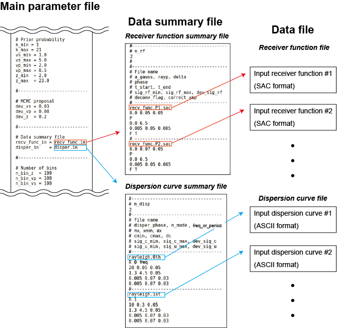

# Overview of input files

Input files to SEIS_FILO's programs are categorized into three classes: (1) [main parameter file](main_parameter_file.md), (2) [data summary file](data_summary_file.md), and (3) [data file](data_file.md). The first one, the main parameter file, is a mandatory input to all programs (i.e., `recv_func_fwd`, `disper_fwd`, and `joint_inv`) and the filename must be provided as the first command-line argument. The user's choice of tuning parameters should be stated in this file. The other ones, the data summary file and the data file, are only required for inversion (i.e., `joint_inv`). The data summary file contains metadata of the input dataset and must be prepared separately for each receiver function and surface wave datasets. The filenames are passed to the program through the parameters [recv_func_in](https://github.com/akuhara/SEIS_FILO/wiki/Parameter-List#recv_func_in) and [disper_in](https://github.com/akuhara/SEIS_FILO/wiki/Parameter-List#disper_in), which should appear in the main file. The data files store the input data. The filenames should appear in the data summary file.

