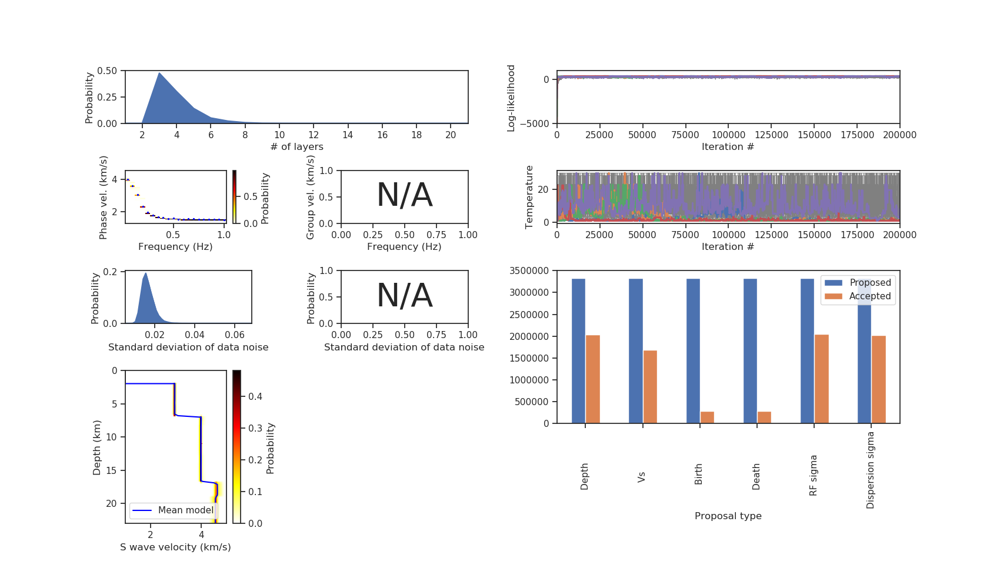

# Plot utilities

The SEIS_FILO package contains two python codes for a easy visualization of inversion results. One is `util/plot_recv_func.py` for receiver function data and the other is `util/plot_disper.py` for dispersion curve data. Both read input and output files of inversion in the current directory and output a PNG file; a filename of the [main parameter file](https://github.com/akuhara/SEIS_FILO/wiki/Main-Parameter-File) must be passed as the first command-line argument. 

## Usage

* `python plot_recv_func.py [main parameter file] [data ID]`

or 

* `python plot_disper.py [main parameter file] [data ID]`,

where data ID is a integer automatically assigned for each input [data file](https://github.com/akuhara/SEIS_FILO/wiki/Data-File). The initial number is 1 and the numbering is done independently for receiver function and surface wave data (both start with 1 and end with [n_rf](parameter_list.md#n_rf) or [n_disp](parameter_list.md#n_disp)). 

## Output

The output filename is `recv_func{xx}.png` for `plot_recv_func.py` and `disper{xx}.png` for `plot_disper.py`, where xx is the data ID to be plotted. An example of output figure is shown below. 

