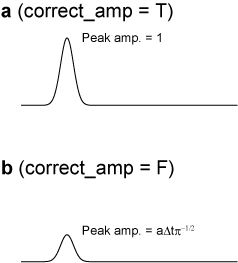

# Receiver function amplitude

We have two options for receiver function amplitudes to accommodate different ways of normalization. The first option (correct_amp = T) compensates for the energy loss caused by low-pass filtering. The second option (correct_amp = F) does not correct this effect. Therefore, peak amplitudes differ depending on the filter parameter. The figure below explains these two types of normalization. Both panels (a) and (b) shows a deconvolved signal by the signal itself, so a delta function is expected if no low-pass filter is applied. If we correct the amplitude loss (correct_amp = T), the peak amplitude remains unity. In contrast, if we do not apply the correction (correct_amp = F), the peak amplitude diminishes in response to the filter choice.  

 