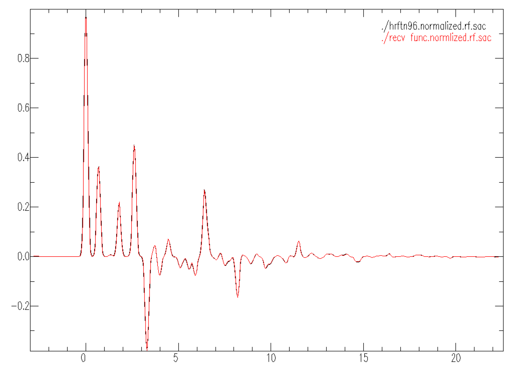

# Test for P receiver function
#### Comparison to [Computer Programs in Seismology (CPS) by Harrmann](http://www.eas.slu.edu/eqc/eqccps.html)

* Red  : Radial receiver function by `recv_func_fwd`
* Black: Radial receiver function by CPS

__NOTE__: Amplitudes are normalized by direct P arrival for comparison.

#### Tested model
|Vp (km/s)|Vs (km/s)|rho (g/cm^3)|Thickness (km)|
|:---|:---|:---|:---|
|5.0|3.0|2.5|5.0|
|7.0|4.0|3.0|10.0|
|8.1|4.6|3.3|-|

#### Reference:

Robert B. Herrmann; Computer Programs in Seismology: An Evolving Tool for Instruction and Research. Seismological Research Letters ; 84 (6): 1081–1088. doi: (https://doi.org/10.1785/0220110096)
